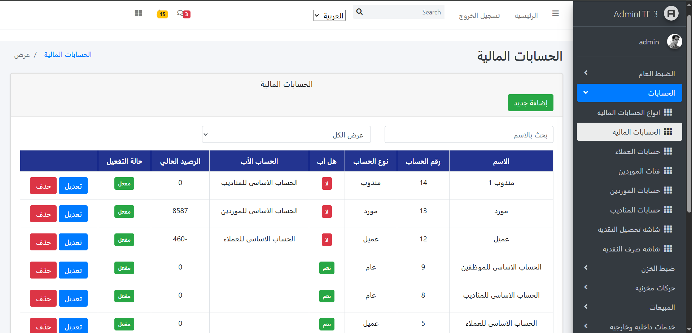
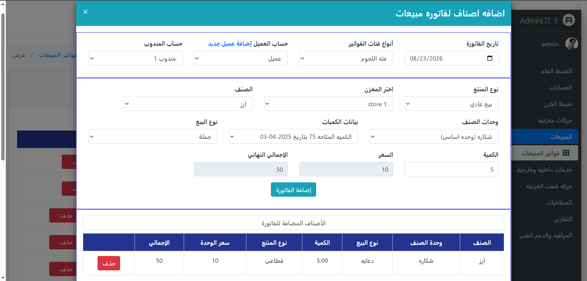
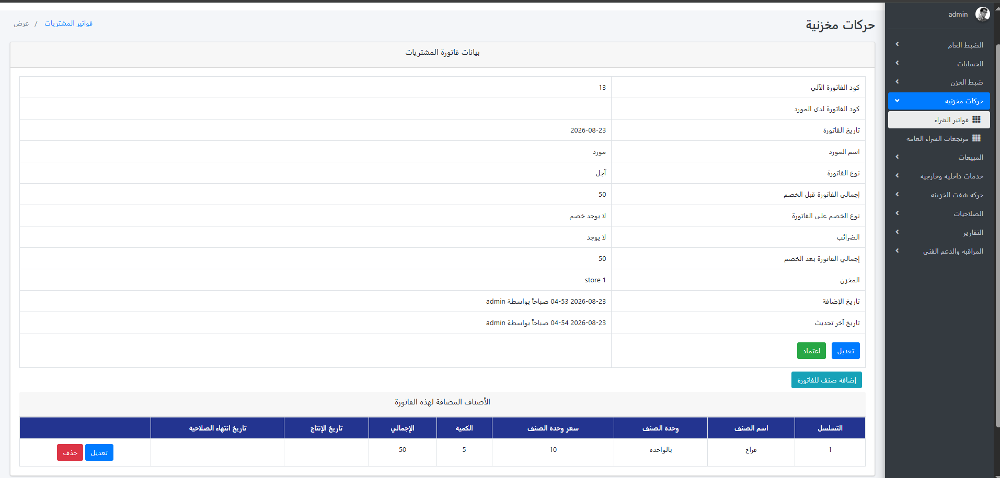
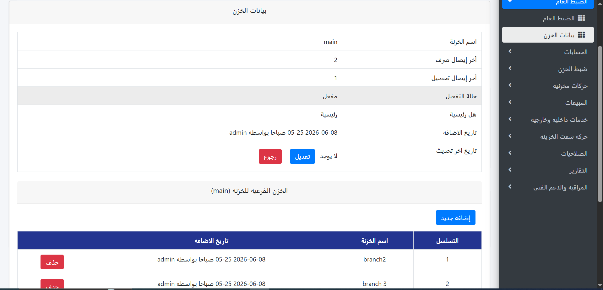

# Sales Management System

A web-based Sales Management System built with **PHP, Laravel, and MySQL**.

The system is designed to manage the main operations of a sales and inventory business, including customers, suppliers, products, invoices, returns, accounts, treasuries, and inventory movements.

The project was developed with a focus on clean backend architecture, business logic organization, database relationships, validation, and maintainable Laravel code.

---

## About The Project

The Sales Management System provides a centralized platform for managing daily business operations.

It handles different parts of the business such as:

-   Customer management
-   Supplier management
-   Product and item management
-   Sales invoices
-   Purchase invoices
-   Sales returns
-   Purchase returns
-   Inventory and stock movements
-   Customer accounts
-   Supplier accounts
-   Treasury management
-   Treasury branches
-   Delegate management
-   Account balances
-   Invoice printing
-   User management
-   Arabic and RTL interface

The system also contains business rules for handling balances, transactions, inventory quantities, invoice approval, and related accounting operations.

---

## Screenshots

### AccountsPage



### Sales Invoice Model



### Purchase invoices



### Treasury Management



---

## Installation & Setup

Follow these steps to run the project locally.

### Requirements

Make sure you have the following installed:

-   PHP 8.1 or higher
-   Composer
-   MySQL
-   Node.js and npm
-   Git

### 1. Clone the Repository

```bash
git clone https://github.com/AhmedRedaElbhery/sales_laravel_project.git
```

Go to the project directory:

```bash
cd sales_laravel_project
```

### 2. Install PHP Dependencies

```bash
composer install
```

### 3. Install Frontend Dependencies

```bash
npm install
```

### 4. Create the Environment File

Copy the example environment file.

#### Windows PowerShell

```powershell
Copy-Item .env.example .env
```

#### Linux / macOS

```bash
cp .env.example .env
```

### 5. Generate the Application Key

```bash
php artisan key:generate
```

### 6. Configure the Database

Create a MySQL database for the project.

Then open the `.env` file and configure your database connection:

```env
DB_CONNECTION=mysql
DB_HOST=127.0.0.1
DB_PORT=3306
DB_DATABASE=sales
DB_USERNAME=root
DB_PASSWORD=
```

Update the values according to your local MySQL configuration.

### 7. Run Database Migrations and Seeders

Run the migrations and seeders together:

```bash
php artisan migrate --seed
```

The seeder will create the required initial data for the application, including the default user account.

### 8. Login Credentials

After running the migrations and seeders, use the default account created by the seeder to log in.

**Username:**

```text
admin
```

**Password:**

```text
admin
```

> If you change the default credentials inside the seeder, use the credentials defined there.

### 9. Build Frontend Assets

For development:

```bash
npm run dev
```

For a production build:

```bash
npm run build
```

### 10. Start the Laravel Development Server

```bash
php artisan serve
```

The application will be available at:

```text
http://127.0.0.1:8000
```

### 11. Open the Application

Open the following URL in your browser:

```text
http://127.0.0.1:8000
```

Then log in using the credentials provided in the **Login Credentials** section.

If you are using Laravel Herd, you can also access the project through the local `.test` domain configured by Herd.

---

## Main Features

### Customers

The system provides customer management functionality including:

-   Create customers
-   Edit customer information
-   Activate and deactivate customers
-   Manage customer opening balances
-   Manage customer accounts
-   Track current balances
-   Associate customers with accounting records

### Suppliers

Supplier management includes:

-   Create suppliers
-   Edit suppliers
-   Activate and deactivate suppliers
-   Manage supplier opening balances
-   Manage supplier accounts
-   Track supplier balances
-   Associate suppliers with accounting records

### Inventory Management

The system manages products and inventory through:

-   Item management
-   Item quantities
-   Main and retail units
-   Unit conversions
-   Stock movements
-   Purchase inventory operations
-   Sales inventory operations
-   Return operations
-   Batch-related inventory operations

The system supports different units for products and handles conversions between main and retail units.

### Sales Invoices

Sales operations include:

-   Creating sales invoices
-   Adding invoice items
-   Calculating quantities and prices
-   Applying discounts
-   Managing invoice totals
-   Updating inventory
-   Updating customer accounts
-   Processing invoice approval
-   Printing invoices

### Purchase Invoices

Purchase operations include:

-   Creating purchase invoices
-   Adding purchased items
-   Managing supplier information
-   Updating inventory
-   Managing purchase prices
-   Updating supplier accounts
-   Processing invoice approval

### Returns

The system supports return operations for both sales and purchases.

Returns can affect:

-   Inventory quantities
-   Customer accounts
-   Supplier accounts
-   Invoice information
-   Stock movements

### Treasury Management

Treasury functionality includes:

-   Creating treasuries
-   Master treasury management
-   Treasury activation
-   Treasury branches
-   Treasury delivery relationships
-   Treasury transactions

The system prevents multiple master treasuries from being created for the same company.

### Accounting

The system includes accounting-related functionality for:

-   Customer accounts
-   Supplier accounts
-   Treasury accounts
-   Opening balances
-   Current balances
-   Debit and credit balances
-   Master account relationships
-   Account types

---

## Architecture

The project follows the Laravel MVC architecture and uses Laravel features to separate application responsibilities.

### Models

Eloquent models are used to communicate with the database and represent the application's main entities.

Examples include:

-   Customers
-   Suppliers
-   Items
-   Accounts
-   Treasuries
-   Invoices
-   Invoice details
-   Inventory movements

### Controllers

Controllers handle HTTP requests and coordinate the application flow.

Business logic is gradually being separated from controllers into dedicated services where appropriate.

### Form Requests

Laravel Form Request classes are used for validation.

This keeps validation rules separated from controller logic and helps keep controllers cleaner.

### Services

Service classes are used to move reusable or complex business logic away from controllers.

This helps keep controllers smaller and easier to maintain.

### Enums

PHP Enums are used for fixed business values instead of using unexplained numeric values throughout the application.

Examples include:

-   Account types
-   Balance statuses
-   Order types
-   Bill types

For example:

```php
AccountTypes::Customer->value
```

---

## Technologies Used

-   PHP
-   Laravel
-   MySQL
-   HTML
-   CSS
-   JavaScript
-   jQuery
-   Bootstrap
-   Laravel Blade
-   Composer
-   npm

---

## Project Structure

The main Laravel application structure includes:

```text
app/
├── Enums/
├── Http/
│   ├── Controllers/
│   └── Requests/
├── Models/
└── Services/

database/
├── migrations/
├── seeders/
└── factories/

resources/
├── views/
├── css/
└── js/

routes/
├── web.php
└── api.php
```

---

## Database

The project uses **MySQL** as the database system.

Laravel migrations are used to create and manage the database structure.

Run migrations:

```bash
php artisan migrate
```

Run migrations and seeders:

```bash
php artisan migrate --seed
```

To reset and recreate the database:

```bash
php artisan migrate:fresh
```

To reset the database and run seeders:

```bash
php artisan migrate:fresh --seed
```

> **Warning:** `migrate:fresh` deletes all existing tables and data in the configured database.

---

## Development

During development, run the Laravel server:

```bash
php artisan serve
```

And compile frontend assets:

```bash
npm run dev
```

For a production frontend build:

```bash
npm run build
```

---

## Author

**Ahmed Reda Elbhery**

GitHub:

https://github.com/AhmedRedaElbhery

LinkedIn:

https://www.linkedin.com/in/ahmed-reda-elbhery/
